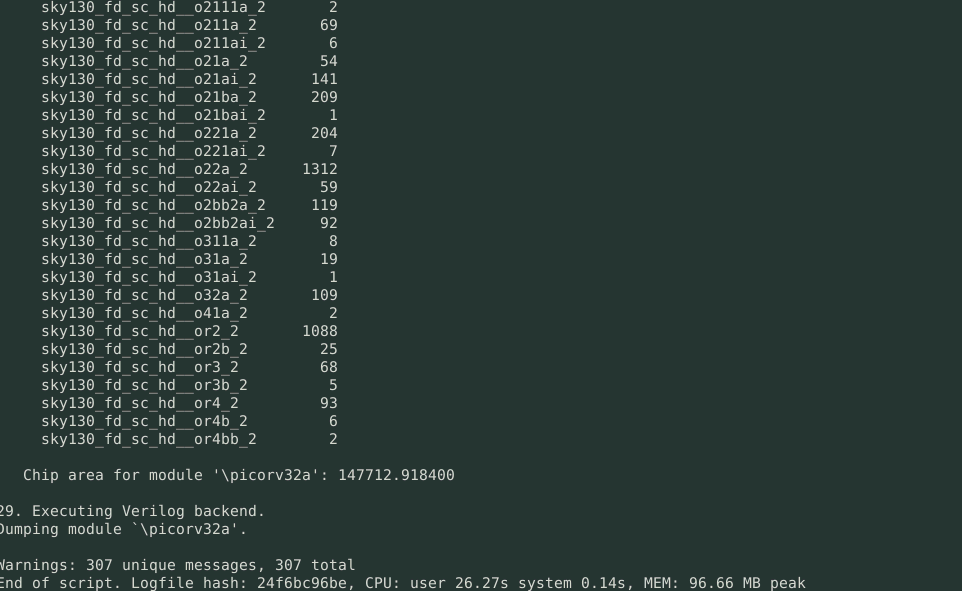
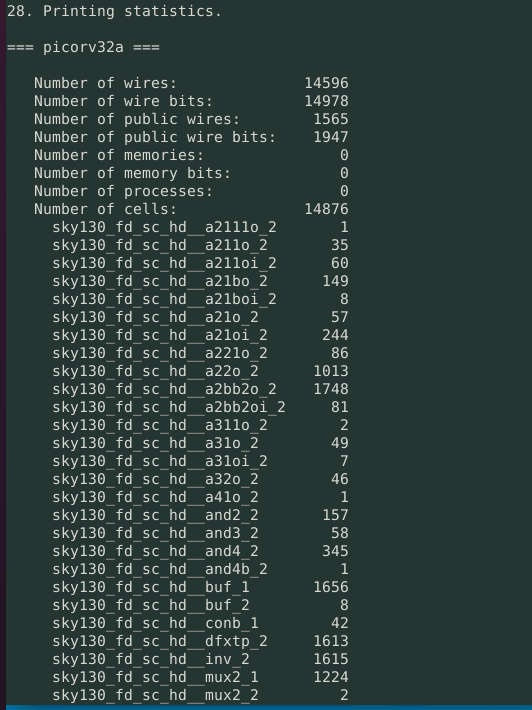
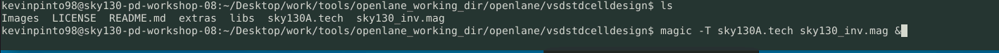
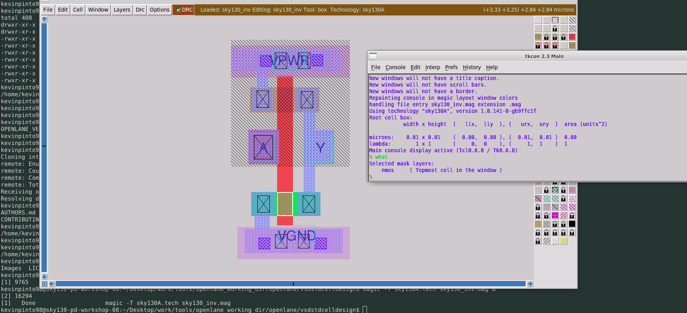
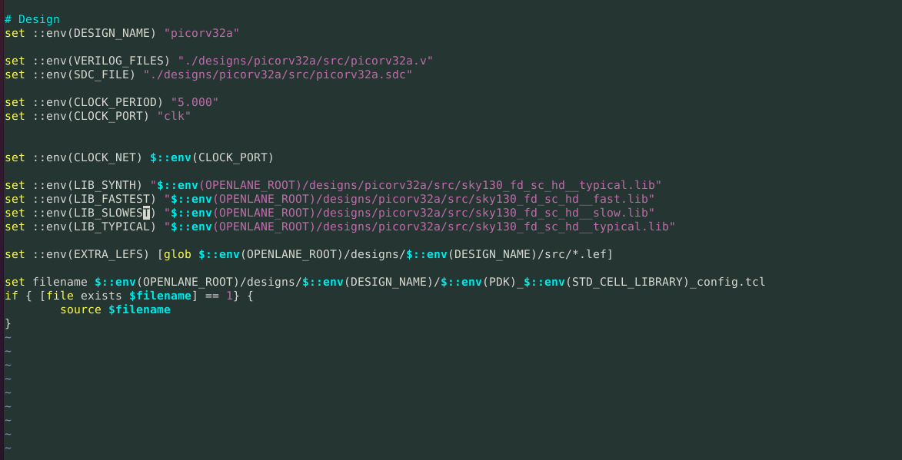
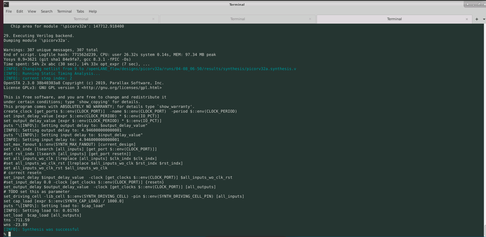

# Advanced Physical Design using OpenLANE/Sky130 Workshop
## Day 1: Inception of open-source EDA, OpenLANE and Sky130 PDK
When we invoke any OpenLANE tool it will be done from the openlane directory. We invoke the tool by running:

    docker run -it -v $(pwd):/openLANE_flow -v $PDK_ROOT:$PDK_ROOT -e PDK_ROOT=$PDK_ROOT -u $(id -u $USER):$(id -g $USER) openlane:rc2

If the above mentioned command is not working then try running the following two commands:

    docker
    ./flow.tcl -interactive

Once the interactive flow launches type:

    package require openlane 0.9

For the design setup stage run:

    prep -design [design name]

To run synthesis type:
    
    run_synthesis

### Day 1 lab results:

## Day 2: Good floorplan vs bad floorplan and introduction to library cells
To run a floor plan we need to type the following command after running synthesis:

    run_floorplan 
Note: There are several switches that we can use to run the floorplan command. The variables that can be used as switches can be foud in the README file in the 
"openlane_working_dir/openlane/configuration" directory. It is not necessary to set all variables as switches. The warnings we receive after running just "run_floorplan" can be ignored.

    magic -T [path to .tech file] lef read [path to merge.lef file] def read [path to .def file] &
This will bring up the layout. Initially the layout will not be in the center. To place it in the center press "s" then press "v". Note: In the above command T stands for technology.
To zoom in first left click then right click then press "z" in order to zoom.
To find info about a particular layer just hover over it and then press "s". Once it gets selected bring up the tkcon terminal and type:

    what 
in the command prompt. The command will then show the information regarding the layer.

In openLANE we use the concept pf HPWL (Half Parameter Wire Length) for global placement and we need to ensure HPWL is as low as possible.
To run placement type the command:

    run_placement
This command performs the placement of standard cells. We will find the terms HPWL and overflow when we run this command.  Our objective is to converge this overflow. If overflow value decreases it means our design will converge and everything
is going right. Floorplan ensures that there are decoupling capacitors at the boundary of standard cells. Placement ensures that standard cells are placed correctly in the standard cell
rows. Power distribution network gets created during floorplan. In our case we will do power networ generation after CTS.

### Day 2 lab results:

## Day 3: Design library cell using Magic Layout and ngspice characterization
After running the magic command we again go into the openLANE flow and type the command:

    set ::env(FP_IO_MODE) 2
to change the strategy of the IO pins. The we run the "run_floorplan" command again.

Commands to run the SPICE simulations:
    
    source [.cir file name]
    run
    setplot 
The above command shows the plots that are available.
    
    [plot name]
    dc2
    display
    plot [variables to be displayed separated by a space]

Commands to be run in tkcon to extract SPICE netlist:

    extract all
    ext2spice cthresh 0 rthresh 0
    ext2spice

To run SPICE files using ngspice run:
    
    ngspice [.spice file]

### Day 3 lab results:

## Day 4: Pre-layout timing analysis and importance of good clock tree
To run CTS type the command:

    run_cts

To get into openROAD after launching openLANE type:

    openroad
One advantage of invoking openROAD from openLANE is that we can access all the variables declared in openLANE.

### Day 4 lab results:

## Day 5: Final steps for RTL2GDS using tritonRoute and openSTA
If we want configurations from the last run without overwriting new configurations modify the design setup stage command as shown below:

    prep -design [design name] -tag [folder_name]

To run the power distribution network simply type the command:

    gen_pdn

For routing run the command:

    run_routing

# Acknowledgements
  - [Kunal Ghosh](https://github.com/kunalg123), Co-founder, VSD Corp. Pvt. Ltd.
  - [Nickson Jose](https://github.com/nickson-jose)